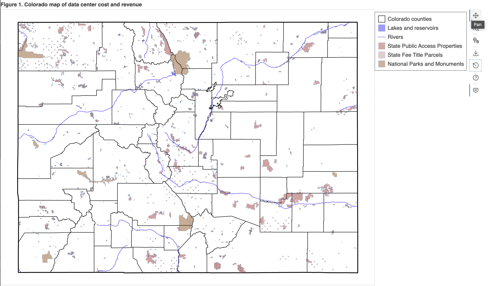

# Colorado Data Center Map of Costs and Revenues
This repository contains the data, code, and images for Colorado data center cost and revenue map.

## How to view and manipulate the interactive graphic online from your browser
You can view the current interactive version of the map in your browser by clicking on [this link](https://htmlpreview.github.io/?https://github.com/OpenSourceEcon/CO-DataCtrCostRev/blob/main/images/co_datactrcostrevmap.html) (it might take a few seconds to load, 75MB). You can also download the HTML file of the visualization [`co_datactrcostrevmap.html`](/images/co_datactrcostrevmap.html) or create it from the source geographic files from the code in the [`CO-DataCtrCostRev`](https://github.com/OpenSourceEcon/CO-DataCtrCostRev) GitHub repository following the steps below.

  

  <em>Figure 1. Screenshot of interactive visualization map of Colorado data center costs and revenues</em>

When you open the HTML file in your browser, there are some functions you can use in the plotting and legend areas and on the right side of the image.
- Muting layers in the legend. You can click on the icon for each layer item in the legend to mute that layer in the image. This allows you to focus on different layers.
- Wheel zoom.

## How to run the code for these analyses on your local computer
Executing the following steps in order will allow you to replicate the analyses in the article of accessing the geographic data, reading it into the computer, reformatting the data, creating an interactive visualization, and calculating area metrics.
- Install Python programming language on your computer. All the analyses in this article use the Python programming language. I recommend you download the free Anaconda distribution of Python here (https://www.anaconda.com/download; skip the registration).
- Not necessary but recommended. Install Git software on your. Follow the instructions at https://git-scm.com/install/. This is version control software that integrates seemlessly with the GitHub online platform. You can download all the files directly from GitHub.com without any Git software. But the Git software will allow you to more efficiently interact long-term with the project.
    - Some good instructions for the basic setup of Git on your computer after installation is [here](https://pslmodels.github.io/Git-Tutorial/content/using/git_config.html).
    - If you have not yet created an account at GitHub.com, I recommend you do it. Create account [here](https://github.com/signup?source=form-home-signup&user_email=).
- Download or clone the [`CO-DataCtrCostRev`](https://github.com/OpenSourceEcon/CO-DataCtrCostRev) GitHub repository. I recommend you use Git.
    - Fork the main repository to your own GitHub account. Go to the main repository https://github.com/OpenSourceEcon/CO-DataCtrCostRev and press the "Fork" button in the upper-right corner of the screen. Select your GitHub account. This will create a copy of the repository on your account to which you can make any changes or upgrades you want. For example, my fork of the main repository is at https://github.com/rickecon/CO-DataCtrCostRev.
    - Clone your fork of the main repository to your hard drive. In the Terminal on your computer (Mac, Linux) or in the Windows prompt, navigate to the directory on your hard drive where you want to save this directory. From the main page of your fork of the repository in your browser, click on the green "Code" button. Copy the URL from the "HTTPS" tab. Then, in your Terminal in the directory where you want to save these files, type: `git clone https://github.com/[YourGitHubHandle]/CO-DataCtrCostRev.git`. You should put your GitHub handle in the spot where it says "[YourGitHubHandle]".
- Create the `CO-DataCtrCostRev` virtual environment using Python's `uv` package. This is similar to a Docker image. It creates an environment of packages and versions on which the Python scripts are known and tested to run correctly across operating systems.
    - [TODO: Put `uv` instructions here]
- In your Terminal or Anaconda prompt and with the `CO-DataCtrCostRev` virtual environment activated, run the [`CO_DataCtrCostRev.py`](CO_DataCtrCostRev.py) script by typing: `run CO_DataCtrCostRev.py`.
